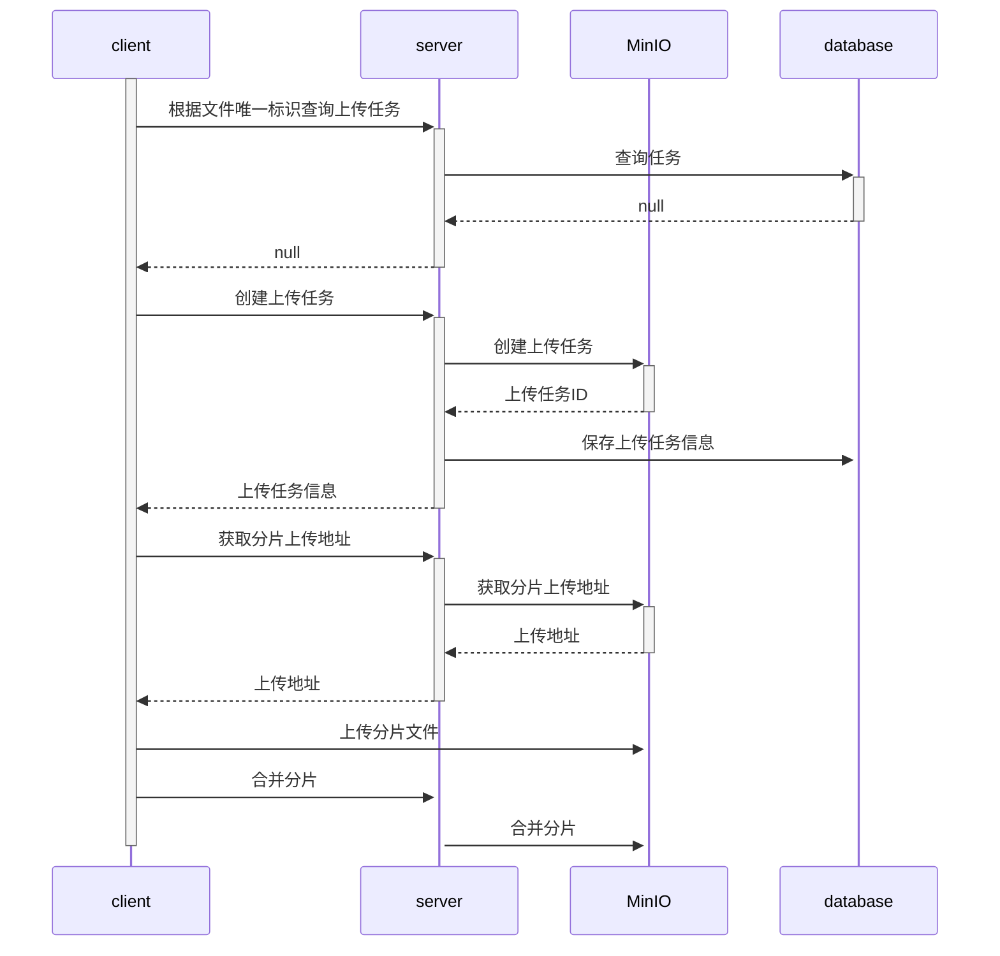

# MinIO-Upload-Demo
## 介绍
前端：Vue2, Element-UI 

后端: SpringBoot3.1.3, Mybatis 

存储服务：MinIO 

注意：后端的minio依赖版本是8.5.17，不同的版本api有差异，主要是学习实现思路
## 实现思路
### 分片上传

### 秒传
秒传功能是指在文件上传之前，后端会根据文件的MD5值查询数据库，如果存在则直接返回文件的URL，这样就实现了秒传功能
### 断点续传
断点续传功能是指在文件上传过程中，如果某些分片上传失败，再次上传时只会上传失败的分片，这样就实现了断点续传功能

这个在前端实现，在后端查询到的任务信息中有已经上传成功的分片列表，前端会根据这个列表进行判断，如果某个分片已经上传成功，则不再上传这个分片
## 后端部署
1. 数据库表初始化

   运行 minio-upload-api/doc/database.sql 中的SQL 

2. 修改配置 

   修改 Application.yml 中数据库和MinIO的配置为你的配置

   ~~注意：确保配置的桶已经在MinIO中创建~~ 实现了程序自动创建桶


3. 运行SpringBoot

## 前端部署
```cmd
cd minio-upload-vue // 进入前端项目的路径

npm install // 安装依赖

npm run serve // 启动服务

```
访问`localhost:7070`

## 参考资料：
https://blog.csdn.net/eagles_on/article/details/132104188 

https://gitee.com/Gary2016/minio-upload

## TODO
- 实现上传失败自动重试
