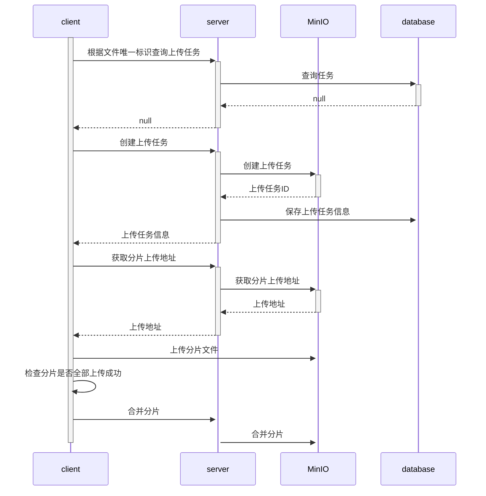
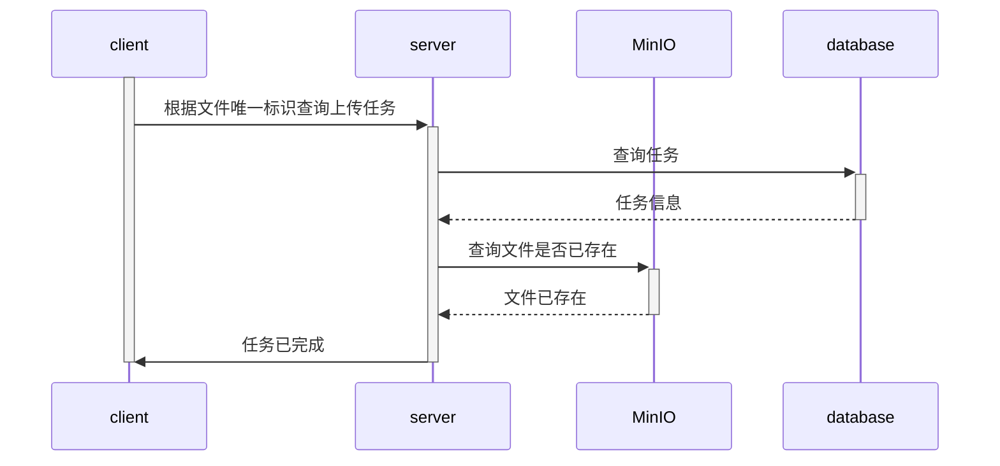
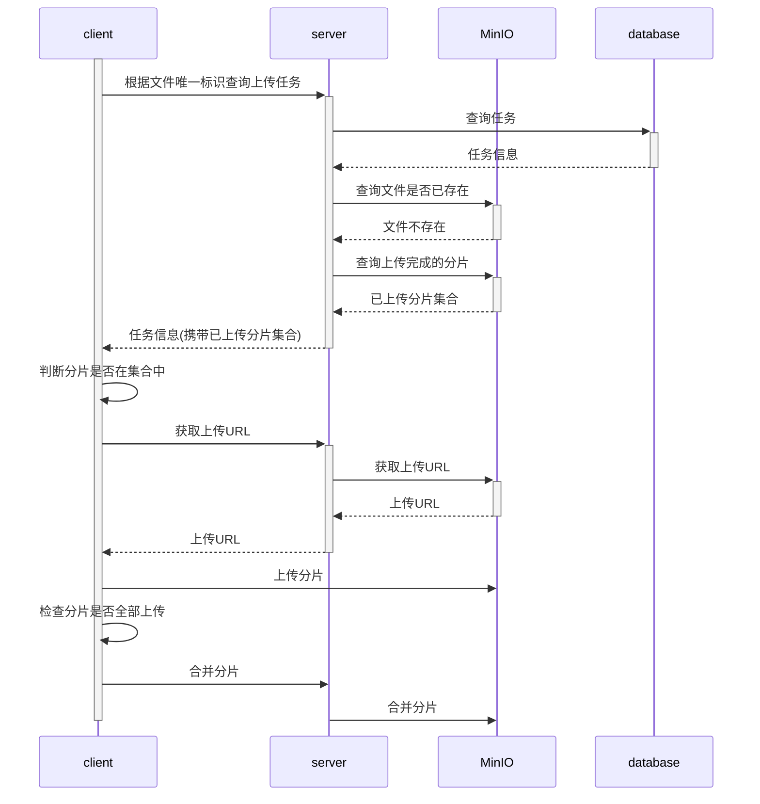

# MinIO-Upload-Demo

本项目基于 **MinIO** 对象存储，搭建了一个完整的大文件上传解决方案，支持分片上传、断点续传与秒传功能。前端使用 `Element UI` 自定义上传逻辑，后端提供接口支持文件分片初始化、上传地址签发、以及分片合并等操作。系统针对大文件上传过程中可能遇到的网络中断、重复上传等问题，进行了可靠性优化与性能提升。

## 技术栈
前端：Vue2， Element UI 

后端: JDK17，SpringBoot3.1.3， Mybatis，SpringMVC

存储服务：MinIO 

## 部署

### 后端部署

1. 数据库表初始化

    运行 minio-upload-api/doc/database.sql 中的SQL 

2. 修改配置 

    修改 Application.yml 中数据库和MinIO的配置为你的配置

    ```yml
    spring:
      application:
        name: minio-upload-api
      datasource:
        driver-class-name: com.mysql.cj.jdbc.Driver
        url: jdbc:mysql://localhost:3306/minio_upload_demo # 修改
        username: root # 修改
        password: 123456 # 修改
    minio:
      endpoint: http://localhost:9000 # 修改
      bucketName: minio-upload-demo # 桶名称无需修改
      accessKey: hOuCmQPVDYheb8yMqDyx # 修改
      accessSecret: BPCb233b3kTWIbx752b125LbleDvG0WxRZ5UgVbL # 修改
    ```

    ~~注意：确保配置的桶已经在MinIO中创建~~ 实现了程序自动创建桶


3. 启动服务

### 前端部署

```cmd
cd minio-upload-vue // 进入前端项目的路径

npm install // 安装依赖

npm run serve // 启动服务
```


浏览器访问`localhost:7070`

## 实现思路
### 分片上传

### 秒传
秒传功能是指在文件上传之前，后端检查文件是否已经上传过，如果存在则直接返回文件的URL，这样就实现了秒传功能




### 断点续传
断点续传功能是指在文件上传过程中，如果某些分片上传失败，再次上传时只会上传失败的分片，这样就实现了断点续传功能




## TODO

- 实现上传失败自动重试


## 参考资料

https://blog.csdn.net/eagles_on/article/details/132104188 

https://gitee.com/Gary2016/minio-upload
